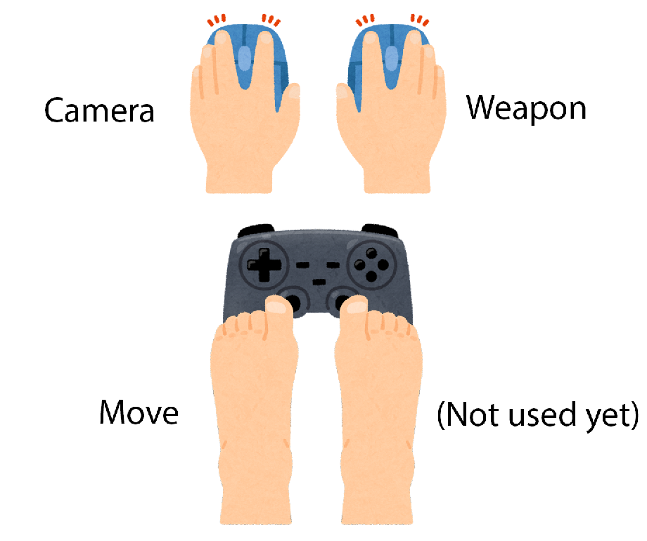

## Dependencies / References

- multi mouse: [jackyyang09Many-Mouse-Unity](https://github.com/jackyyang09/Many-Mouse-Unity)
- face detection: [keijiro/UltraFaceBarracuda](https://github.com/keijiro/UltraFaceBarracuda)
- face mesh detection: [PINTO0309/facemesh_onnx_tensorrt](https://github.com/PINTO0309/facemesh_onnx_tensorrt)
- webcam input: [keijiro/TestTools](https://github.com/keijiro/TestTools)

## 1. View & Gun

- Camera viewing: left mouse
- Righthand gun: right mouse
- Move: left foot on joystick

## 2. DoubleGun ( with webcam )

- Camera viewing: turn your head
- Move: move your head
- 2 guns: left&right mouse

